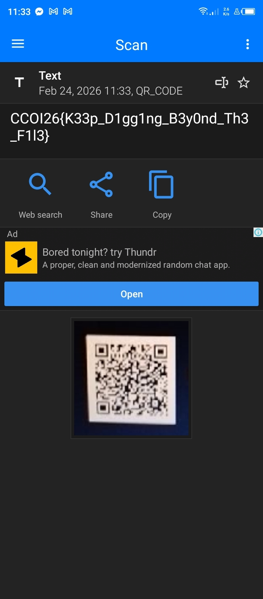

# Beyond the file — Write-up

**Category:** Misc 
**Difficulty:** Medium

---

## Contexte
Cherche le contenu caché dans une images

## 1) Outils utilisés

- `file` (identifier le type de fichier)
- `strings` (extraction de chaînes, notamment UTF-16LE)
- `grep` (filtrage)
- `base64` (décodage)
- `pngcheck` (pour verifer le vrai format png)

## 2) Les etapes suivis

- tester la commande pour voir le vrai formation du fichier


Comme nous avons constaté qu'on a belle et bien un fichier image png.
Testons strings pour verifier le contenu dans le fichier.
Commençons d'abord, à voir l'entete du fichier


Nope rien, passons maintenains à voir la fin du fichier


Uhmm intéressant, on constante qu'on a une ligne qui etait codé en base64 

```text 
SBKTiVBORw0KGgoAAAANSUhEUgAAAIcAAACHAQMAAAAGKdhJAAAABlBMVEUAAAD///+l2Z/dAAAAAnRSTlP//8i138cAAAAJcEhZcwAACxIAAAsSAdLdfvwAAAHASURBVEiJ3dY7juQgEAbgsgjIxhdA4hpkXMm+gB8XsK9ExjWQuADOCJBrfo9neqVNXB2sVhrkoPUFYOrlJv570S+RQjR4tbk2hkZkhXJwGxzNwYxsZhbL9dtysMW1Qb8hk7Ontkd8T2bmhfLp3xFuYzR4PujPLR4F8bkFzytij4JVPO+BF2df2XmWYAZqk1ccqQ9WKKeza80npck18iyU4pALtYc0X+mQyumRPjNptbjW3acL5KiGvFo09mkfX/tIhDlvRF3EC6dBLCiSvvJGpotqu+tZIEVnvEAfcXoaxHJq9E4afF7Ibl4qhdSm7UYZlx0jS8W1PqAs1R5Nf1emRLRC6otHq9IdVYlwTH3MuO9C6d5HJDVzQC7sGhVXFsrBaJm8IqpsJi+WYHdGgeU1pLsLJHKNgqv+1c4NI0Uo5Wo6jEf0Hc1RKtc7a7ty5tjm100fJSBENDIKBpVmpVJxaEKrHhGxZaFgHVEVp9CwRVuhYNZNOvUVUTV3x0kEc3Xyea2Yrrb8fGWeBd+LK4mtq9R9x0cqR6DJJ/JWLpirmI2ozCIXbnPErEPf5T2yUK74kMFY6K96tkL5d/8T/qd8ApA0zJJocxVsAAAAAElFTkSuQmCC
``` 

La grosse ligne qui commence par SBKTiVBORw0KGgo...
➡️ Le morceau iVBORw0KGgo est ultra reconnaissable : c’est le début d’un PNG encodé en Base64.
Donc ton map.png contient un autre PNG caché, stocké en texte Base64 (souvent collé à la fin du fichier ou dans des données cachées).

Le IEND tout en bas est aussi un indice : IEND est le dernier chunk d’un PNG (fin de fichier PNG).

Extraire ce base64 en une seule ligne 


Rgardons ces contenus


Decodants ce fichier hidden.b64 en un fichier .png


Apres cette commande nous obtiendrons un fichier hidden.png, si on ouvre ce fichier on voit un Qr Code. Après le scan:

Booooom, la flag : 




## Flag

**Flag : CCOI26{K33p_D1gg1ng_B3y0nd_Th3_F1l3}**


